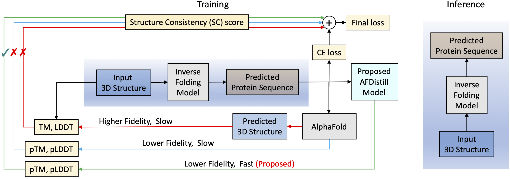
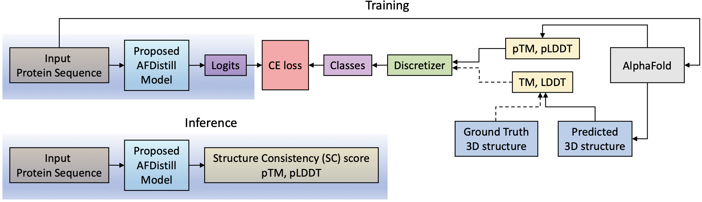

<div align="center">    
 
# AlphaFold Distillation for Inverse Protein Folding

</div>

## Description   
We propose to apply knowledge distillation to the confidence metrics of the AlphaFold model, such as pTM or pLDDT scores. Our goal is to develop a fast, end-to-end differentiable distilled model, that can then be integrated as a structural consistency regularizer for training inverse protein folding model or other protein optimization tasks.


## Inverse Protein Folding using AFDistill
<p align="center">
  
</p>
Using forward folding models like AlphaFold one can estimate structure from generated sequence and compare with ground truth to get TM or LDDT, however this is slow and impractical in the optimization loop (red line). 
Alternatively, one could use directly the AlphaFold's internal confidence metrics (pTM or pLDDT), but this results in lower fidelity and still slow solutions (blue line). Our approach distills AlphaFold's confidence metrics into fast and differentiable model called AFDistill (green line). 
AFDistill maintains comparable accuracy to AlphaFold's pTM/pLDDT estimates and can be efficiently integrated into the training loop. The inference of our improved inverse folding model remains unaltered, as shown on the figure's right side.

## AFDistill Training  
Top diagram shows distillation training of AFDistill. The scores from AlphaFold's confidence estimation are denoted as pTM and pLDDT, while the scores which are computed using ground truth and the AlphaFold's predicted 3D structures are denoted as TM and LDDT. These values are then discretized and treated as class labels during cross-entropy (CE) training. Note that the training based on TM/LDTT is limited since the number of known ground truth structures is small. The bottom diagram shows the inference stage of AFDistill, where for each protein sequence it estimates pTM and pLDDT scores.
<p align="center">
  
</p>

## Environment
To run this code, please install PyTorch and Pytorch Lightning (we tested the code on Pytorch 1.13 and Pytorch Lightning 1.8.1)
  

## Data for AFDistill Training

- ### AlphaFold SwissProt Dataset:
```bash
# download dataset
aria2c -c https://ftp.ebi.ac.uk/pub/databases/alphafold/latest/swissprot_pdb_v4.tar

# unzip it
for f in *.pdb.gz; do gunzip -c -v "$f" > "${f%.*}" && rm "$f"; done
```

- ### PDB Dataset

 ```bash
# download partitioned and archived dataset   
rsync -rlpt -v -z --delete rsync.ebi.ac.uk::pub/databases/pdb/data/structures/divided/pdb/ <destination_pdb_directory>
```

```bash
# unzip and collect pdbs in one location
src_dir="pdbs"
dest_dir="unzipped_pdbs"

mkdir -p $dest_dir
for subdir in $(ls -U $src_dir); do
    if [ -d "$src_dir/$subdir" ]; then
        for file in $(ls -U $src_dir/$subdir/*.ent.gz); do
        gunzip -c $file > $dest_dir/$(basename $file .gz)
        done
    fi
done
```

- ### PDB to UniProt Mapping 
https://www.ebi.ac.uk/pdbe/docs/sifts/quick.html 
```bash
wget ftp://ftp.ebi.ac.uk/pub/databases/msd/sifts/flatfiles/tsv/pdb_chain_uniprot.tsv.gz
```

- ### Download TM align executable
```bash
wget https://zhanggroup.org/TM-align/TMalign_cpp.gz
```


## Training
There are two scripts to run AFDistill using TM or pLDDT scores
```bash
# naviagate to scripts directory
cd scripts

# train AFDistill to predict TM score 
bash train_tm.sh

# train AFDistill to predict pLDDT score
bash train_plddt.sh
```

For TM score training, these are the main data directories:
```
--af_data           <SwissProt_directory>     <-- AlphaFold SwissProt dataset 
--pdb_uniprot_map   <pdb_chain_uniprot_file>  <-- PDB to UniProt map
--tm_exec           <TMalign_cpp>             <-- TM align executable
--cached_pdbs       <cached_pdbs>             <-- Create dir to store new PDBs not found in PDB dataset (if any)
--precomputed_data  <tm_precomputed.pkl>      <-- Precomputed TM data to load or to store results
--pdb_dataset       <PDB_directory>           <-- PDB dataset 
```
Note that if there is no `tm_precomputed.pkl`, it'll take a while to initially process the data and create this file. 
In this case, it is recommended to run:
```bash
cd dataset
python dataset_tm.py --num_jobs 5 --af_data <SwissProt_directory> --pdb_uniprot_map <pdb_chain_uniprot_file> --tm_exec <TMalign_cpp> --cached_pdbs <cached_pdbs> --dump_results <tm_precomputed.pkl> --pdb_dataset <PDB_directory> --log info
```


For pLDDT score training, these are the main data directories:
```
--af_data           <SwissProt_directory>     <-- AlphaFold SwissProt dataset 
--precomputed_data  <plddt_precomputed.pkl>   <-- Precomputed pLDDT data to load or to store results
```

Similarly as for TM, if there is no `plddt_precomputed.pkl`, it'll take a while to create it. 
In this case, it is recommended to run:
```bash
cd dataset
python dataset_plddt.py --af_data --precomputed_data
```

### Training Results
Results can be visualized in Tensorboard
```bash
tensorboard --logdir output
```

## Testing
```bash
# naviagate to scripts directory
cd scripts

# evaluate AFDistill on TM score prediction
bash test_tm.sh

# evaluate AFDistill on pLDDT score prediction
bash test_plddt.sh
```

## Inference
Inference on a single amino acid sequence
```bash
# naviagate to scripts directory
cd scripts

# run inference on a single protein sequence 
bash inference.sh
```
Main parameters for inference script:
```
--type         plddt or tm  <-- Type of previously trained AFDistill model 
--single_input EVQLVESG...  <-- Single amino acid sequence to make predictions on
--version      1            <-- Training experiment ID
```

## Downstream Applications
Once AFDistill has been trained, it can then be applied as a structure consistency (SC) score for solving the task of inverse protein folding. 
Here we show three examples. In all of them the idea remains the same - modify corresponding training scripts to add AFDistill
regularization and train inverse folding model as in the original scripts. 

1. Include imports
```
import sys
sys.path.insert(0, <path_to_AFDistill_repo>)
from model.litdistiller import LitDistiller
```

2. Load pretrained AFDistill model (TM or pLDDT)
```
afdistill = LitDistiller.load_from_checkpoint(checkpoint_path='output/plddt_v1/checkpoints/checkpoint_last.ckpt', alphabet_downstream='ACDEFGHIKLMNPQRSTVWY').cuda()
```
`alphabet_downstream` is the vocabulary of amino acids in downstream application that will be mapped to AFDistill vocabulary

3. Collect logits from inverse folding model
```
 AFlogits = []
 for l, m in zip(logits, mask):
     AFlogits.append(l[m>0])
```

4. Compute strcuture consistency (SC) loss and add to the original loss
```
 sc_loss = afdistill.sc_loss(AFlogits).mean()
 loss += 1.0 * torch.exp(-sc_loss) # modify weighting (1.0), if necessary
```

5. Train inverse folding model to get improved performance. Inference remains unchanged.

### GVP
https://github.com/drorlab/gvp-pytorch
1. Clone repo
```
git clone git@github.com:drorlab/gvp-pytorch.git
```

2. Navigate to the repository and set to specific commit
```
cd gvp-pytorch
git checkout 82af6b22eaf8311c15733117b0071408d24ed877
```

3. Apply provided patch (this will modify `run_cpd.py`)
```
git apply /path/to/AFDistill/downstream/GVP/patch
```
Once the patch was applied, edit `run_cpd.py` to update paths for the AFDistill directory and desired pretrained checkpoint.

4. Now use GVP's original training/testing scripts as is 


### ProteinMPNN
https://github.com/dauparas/ProteinMPNN
1. Clone repo
```
git clone git@github.com:dauparas/ProteinMPNN.git
```

2. Navigate to the repository and set to specific commit
```
cd ProteinMPNN
git checkout fee247c8ac87a73590cdc99289d227720c0cc197
```

3. Apply provided patch (this will modify `training/training.py`)
```
git apply /path/to/AFDistill/downstream/ProteinMPNN/patch
```
Once the patch was applied, edit `training/training.py` to update paths for the AFDistill directory and desired pretrained checkpoint.

4. Now use ProteinMPNN's original training/testing scripts as is 


### PiFold
https://github.com/A4Bio/PiFold

1. Clone repo
```
git clone git@github.com:A4Bio/PiFold.git
```

2. Navigate to the repository and set to specific commit
```
cd PiFold
git checkout f111d66ed4c184b9614ed670da26469dcc35e588
```

3. Apply provided patch (this will modify `methods/prodesign.py`)
```
git apply /path/to/AFDistill/downstream/PiFold/patch
```
Once the patch was applied, edit `methods/prodesign.py` to update paths for the AFDistill directory and desired pretrained checkpoint

4. Now use PiFold's original training/testing scripts as is 
 
